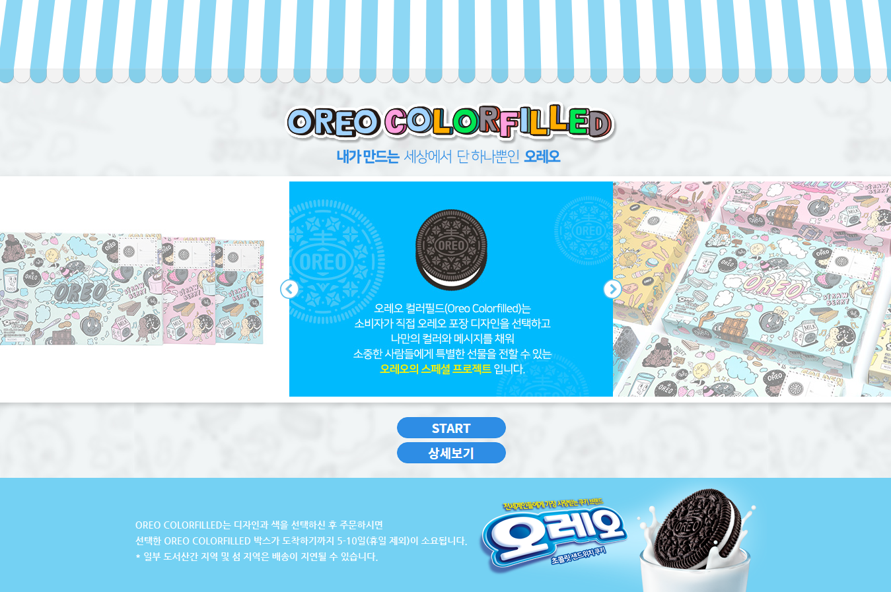
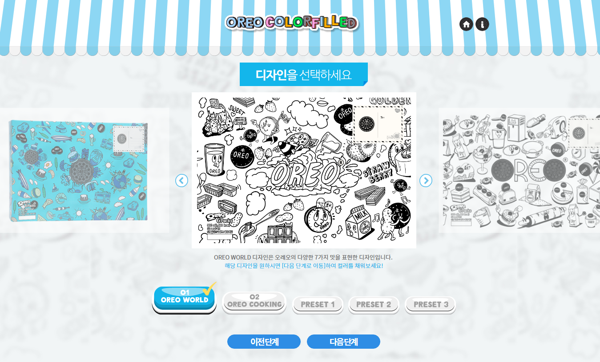
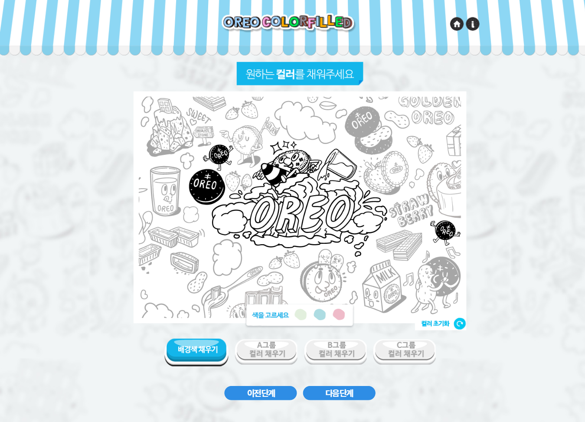
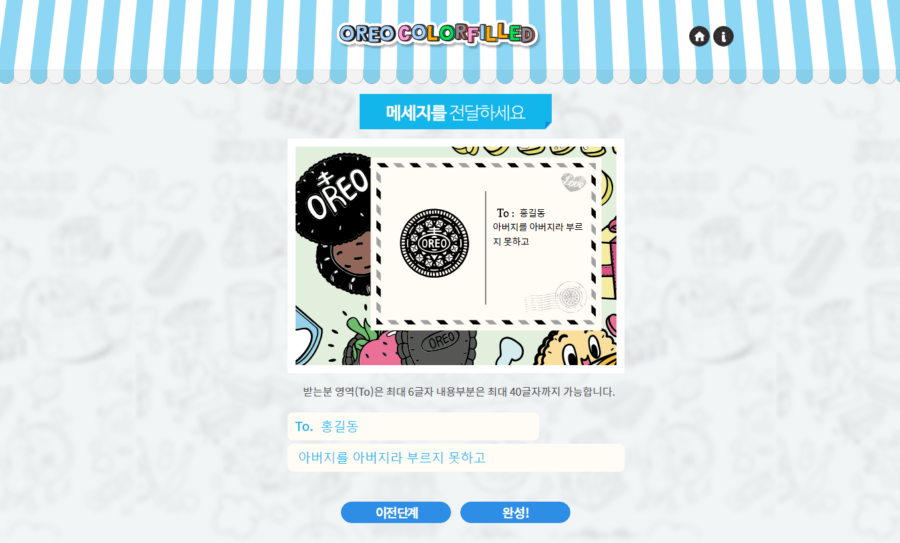

# Oreo Colorfilled Cover

## Overview

7월 초 Gmarket 기획전을 통해 진행되었던 Oreo Colorfilled 프로젝트에 대한 remaking.

이미지 리소스들은 해당 프로덕트의 것들을 그대로 사용하되, 일부 UI를 변경하여 작업.

## Support Browser

IE 10+ 및 최신 major browsers

## Develop Environment

- Develop Tool: Visual Studio Code
- Task Runner: Gulp
- Used Languages: HTML, CSS, JavaScript(ES6), SCSS

## Used Libraries

- requirejs
- lodash
- axios (with es6-promise for IE)
- clipboard.js


## Focus

- Web Accessibility with WAI-ARIA
- Develop in ES6 using MVC pattern

## Run

```
$ npm install

$ gulp
```

## Notes

- Page 전체 틀은 기존 Oreo Colorfilled 프로젝트를 활용
- Page의 일부 각 컴포넌트들에 대해 UI 변경 기획 동시 진행
- 7/19 ~ 7/31 단기 프로젝트 참여로 인해 작업 일시 중지
- 8/1 ~ 8/17 정보화진흥원 웹 접근성 오픈 아카데미 강의 준비로 작업 일시 중지
- 8/23 ~ 8/24 단기 프로젝트 참여로 인해 작업 일시 중지

## UI Changes from origin product

### Common

- 규격화 되지 않은 스타일들(글꼴 크기, 컬러 등)을 컴포넌트 단위 규격으로 재정립
- multiple page를 SPA(Single Page Application)으로 변경

### index page



As-Is:

슬라이드가 주 콘텐츠이지만 영역의 높이가 낮아 큰 해상도의 화면(ex. 1920 * 1024, 스크린샷은 1366 * 768 해상도
기준)에서 전체 콘텐츠에 비해 집중도를 가져오지 못하며 일정 너비를 넘어설 경우 슬라이드 항목들을 제외한 많은 여백이
발생 됨.

To-Be:

시선의 집중도를 끌어올리기 위해 단일 항목 슬라이드로 변경 및 항목의 크기 변경

### Step 1 page



As-Is:

전체 디자인과 그다지 어울리지 않는 버튼 디자인, 과도한 안내 설명

To-Be:

슬라이더 인디케이터를 디자인 선택 버튼으로 변경 및 슬라이더 컨트롤러와 통합 <br>
인디케이터를 preivew로 사용하여 단일 항목 슬라이드로 변경

### Step 2 page



As-Is:

색을 칠할 대상을 선택하기 위한 버튼과 색을 고르기 위한 버튼, 색칠한 결과를 보기 위한 시선의 흐름이 역방향으로
흐르며 선택을 위한 동선의 폭이 큼

To-Be:

색칠의 대상과 각 대상에 대한 색 버튼들을 각각의 그룹으로 묶어 아코디언 패턴의 UI로 변경 <br>
시선의 흐름을 좌 → 우 → 좌 → 우의 지그재그로 최대한 유지

### Step 3 page



As-Is:

입력 상자와 preview 간의 시선 이동 거리가 멀음

To-Be:

시선을 분산시키지 않고 행위에 집중할 수 있도록 preivew와 입력 상자를 통합